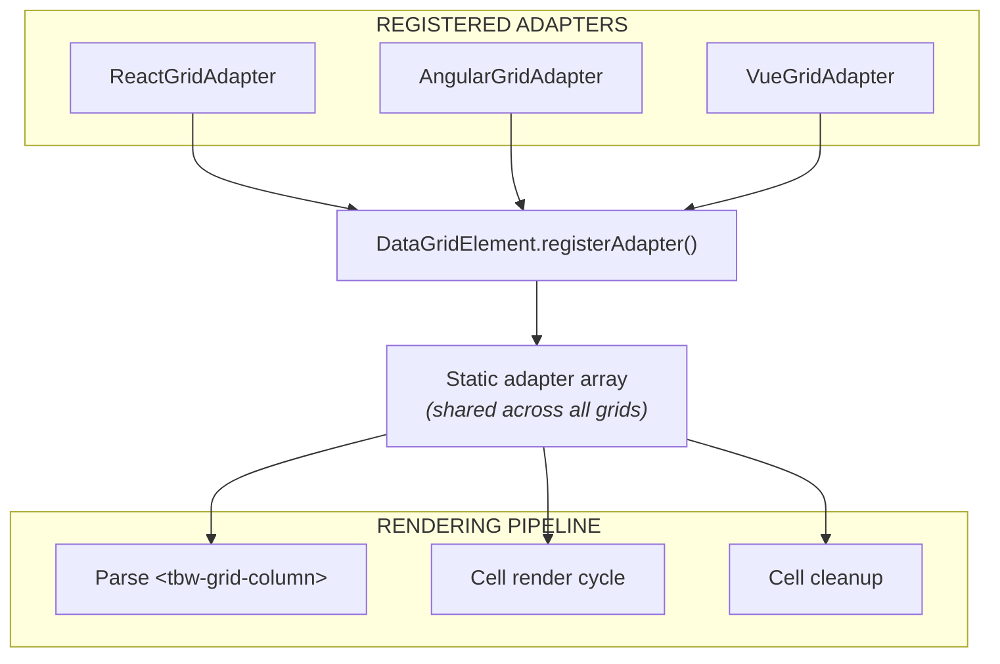

Framework adapters let React, Angular, and Vue intercept grid rendering to support JSX components, Angular templates, and Vue slots as cell renderers and editors.

For an introduction and links to the official adapters, see [Framework Adapters](/grid/framework-adapters/). For grid-core internals see [Architecture](/grid/architecture/). For typed signatures see the [Framework Adapter API reference](/grid/api/framework-adapters/).

## Architecture



## FrameworkAdapter Interface

Adapters implement these methods:

| Method | Required | Purpose |
|--------|----------|---------|
| `canHandle(element)` | Yes | Check if this adapter can process the element |
| `createRenderer(element)` | Yes | Return a cell renderer function, or `undefined` to pass |
| `createEditor(element)` | Yes | Return a cell editor function, or `undefined` to pass |
| `processConfig(config)` | No | Transform framework-specific config (e.g., component classes → render functions) |
| `getTypeDefault(type)` | No | Provide app-wide type defaults from framework's DI/registry |
| `releaseCell(cellEl)` | No | Cleanup when cell DOM is recycled (unmount React roots, destroy Angular views) |
| `createToolPanelRenderer(element)` | No | Support framework components in tool panel sidebar |

## Registration

Adapters register statically on `DataGridElement` — typically at module load time:

```typescript
// React: registers immediately on import
const globalAdapter = new GridAdapter();
DataGridElement.registerAdapter(globalAdapter);

// Angular: registers via Grid directive
DataGridElement.registerAdapter(this.adapter);

// Vue: registers in DataGrid component onMounted()
```

This is why importing `@toolbox-web/grid-react` (or any adapter package) auto-registers the adapter — no separate setup needed.

## Adapter Invocation Points

Adapters are called at four points in the grid lifecycle:

**1. Light DOM Column Parsing** — When `<tbw-grid-column>` elements are parsed, each adapter is tried until one handles the renderer/editor:

```typescript
const viewAdapter = adapters.find((a) => a.canHandle(viewTarget));
if (viewAdapter) {
  config.viewRenderer = viewAdapter.createRenderer(viewTarget);
}
```

**2. Config Processing** — When `gridConfig` is set, the adapter can transform component classes to render functions:

```typescript
set gridConfig(value) {
  if (value && this.__frameworkAdapter?.processConfig) {
    value = this.__frameworkAdapter.processConfig(value);
  }
}
```

**3. Cell Rendering** — Type defaults are resolved through the adapter:

```typescript
const appDefault = adapter.getTypeDefault(col.type);
if (appDefault?.renderer) return appDefault.renderer;
```

**4. Cell Cleanup** — When virtualization recycles a row, adapters unmount framework components:

```typescript
grid.__frameworkAdapter?.releaseCell?.(cell);
// React: unmounts React root
// Angular: destroys component view
// Vue: unmounts app instance
```

## See Also

- **[Angular Adapter](/grid/angular/getting-started/)** — `@toolbox-web/grid-angular` usage and base classes.
- **[React Adapter](/grid/react/getting-started/)** — `@toolbox-web/grid-react` usage and patterns.
- **[Vue Adapter](/grid/vue/getting-started/)** — `@toolbox-web/grid-vue` usage and composables.
- **[Plugin Architecture](/grid/plugin-development/architecture/)** — How plugins integrate with the same render pipeline adapters hook into.
