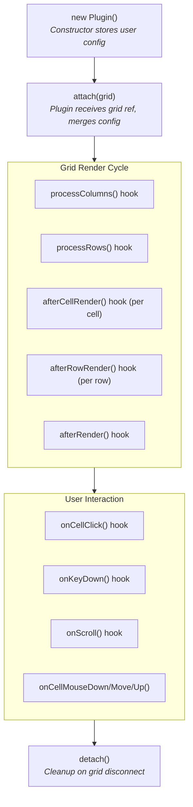
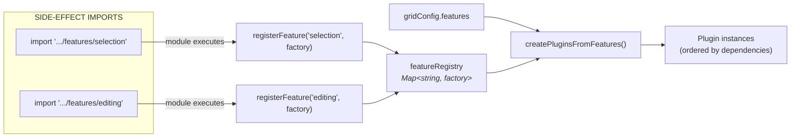

This page describes how the plugin and feature subsystems work inside `@toolbox-web/grid`. It is the contributor-facing companion to the [Authoring Guide](/grid/plugin-development/custom-plugins/) and to the typed [Plugin Development API reference](/grid/api/plugin-development/).

For grid-core internals (render scheduler, virtualization, DOM structure, configuration), see the main [Architecture](/grid/architecture/) page.

## Plugin System

### Plugin Lifecycle



### Creating a Plugin

```typescript
import { BaseGridPlugin, CellClickEvent, type GridElement } from '@toolbox-web/grid';
import styles from './my-plugin.css?inline';

interface MyPluginConfig {
  enabled?: boolean;
}

export class MyPlugin extends BaseGridPlugin<MyPluginConfig> {
  readonly name = 'myPlugin';
  override readonly styles = styles;

  protected override get defaultConfig(): Partial<MyPluginConfig> {
    return { enabled: true };
  }

  override attach(grid: GridElement): void {
    super.attach(grid); // MUST call super
    // Setup listeners with this.disconnectSignal for auto-cleanup
  }

  override afterRender(): void {
    if (!this.config.enabled) return;
    // Access DOM via this.gridElement
  }

  override onCellClick(event: CellClickEvent): boolean | void {
    // Return true to prevent default behavior
  }
}
```

### Plugin Communication

Plugins communicate via three channels:

**Event Bus** (plugin-to-plugin notifications):

```typescript
// Listen for events from other plugins
this.on('selection-cleared', (detail) => { /* ... */ });

// Emit to other plugins only
this.emitPluginEvent('selection-cleared', { source: 'keyboard' });

// Emit to both plugins AND external addEventListener consumers
this.broadcast('sort-change', { sortModel: [...this.sortModel] });
```

**Query System** (sync state retrieval):

```typescript
// Declare queryable state in manifest
static override readonly manifest = {
  queries: [{ type: 'canMoveColumn', description: 'Check movability' }],
};

// Handle queries
override handleQuery(query: PluginQuery): unknown {
  if (query.type === 'canMoveColumn') return !column.pinned;
  return undefined;
}

// Query from another plugin
const responses = this.grid.query<boolean>('canMoveColumn', column);
```

### Plugin Manifest

Plugins declare owned config properties via a static `manifest`:

```typescript
import type { PluginManifest } from '@toolbox-web/grid';

static override readonly manifest: PluginManifest<EditingConfig> = {
  ownedProperties: [
    { property: 'editable', level: 'column', description: 'the "editable" column property' },
    { property: 'editor',   level: 'column', description: 'the "editor" column property' },
  ],
  configRules: [
    {
      id: 'editing/invalid-edit-on',
      severity: 'warn',
      message: '"editOn: dblclick" has no effect when editable is false',
      check: (config) => config.editOn === 'dblclick' && config.editable === false,
    },
  ],
};
```

See the [Custom Plugins guide → Plugin Manifest](/grid/plugin-development/custom-plugins/#plugin-manifest) for the full schema (queries, events, incompatibleWith, hookPriority).

The grid validates at runtime that properties like `editable: true` are only used when the owning plugin is loaded, and provides helpful error messages with import hints.

### Validated Properties

| Property       | Required Plugin         | Level  |
| -------------- | ----------------------- | ------ |
| `editable`     | `EditingPlugin`         | Column |
| `editor`       | `EditingPlugin`         | Column |
| `editorParams` | `EditingPlugin`         | Column |
| `group`        | `GroupingColumnsPlugin` | Column |
| `pinned`       | `PinnedColumnsPlugin`   | Column |
| `columnGroups` | `GroupingColumnsPlugin` | Config |

Validation runs in the `RenderScheduler.mergeConfig` callback, **after** plugins are initialized. Error messages clearly state which plugin is missing and how to import it.

### Hook performance budget

Every plugin hook runs in the grid's hot path. Keep this table in mind when implementing them — work that's cheap per cell becomes expensive when you multiply it by the number of visible cells and the frequency of scroll events.

| Hook | When it runs | Impact | Rule of thumb |
|------|-------------|--------|---------------|
| `processColumns()` | Every data/config update | Low | Runs once per update — fine for non-trivial work |
| `processRows()` | Every data update | Medium | Runs over full dataset — `O(n)` work is OK, `O(n²)` is not |
| `afterCellRender()` | Every visible cell, every scroll frame | **High** | Keep < 0.1 ms per call; no DOM queries, no allocations |
| `afterRowRender()` | Every visible row, every scroll frame | **High** | Same budget as cells; cache anything reusable in `processRows()` |
| `afterRender()` | Every render cycle | Medium | Avoid DOM queries; use cached refs from earlier hooks |

**Profiling slow plugins:** open Chrome DevTools → Performance, record a scroll, and look for your plugin name in the flame chart. Work that consistently shows up in `afterCellRender` / `afterRowRender` should usually move to `processRows()` and be cached.

### Style injection

Plugins must not append `<style>` elements as children of `<tbw-grid>` — they get removed by `replaceChildren()` on the next render. Use one of:

```ts
// ✅ The `styles` property (recommended for plugins — adopted into the grid's stylesheets)
override readonly styles = `
  .my-class { color: blue; }
`;

// ✅ registerStyles for runtime-injected / dynamic CSS
this.gridElement.registerStyles('my-id', '.my-class { color: blue; }');

// ✅ Standard global CSS also works (stylesheet, <style> in <head>)

// ❌ Child <style> nodes inside the grid are wiped on render
const style = document.createElement('style');
this.gridElement.appendChild(style);
```

---

## Feature Registry

The **features API** is the recommended way to enable grid capabilities. It wraps the plugin system with declarative configuration and tree-shakeable side-effect imports.

### Why Features?

| Aspect | Features (recommended) | Plugins (advanced) |
|--------|----------------------|--------------------|
| API | `features: { selection: 'row' }` | `plugins: [new SelectionPlugin({ mode: 'row' })]` |
| Import | `import '@toolbox-web/grid/features/selection'` | `import { SelectionPlugin } from '@toolbox-web/grid/plugins/selection'` |
| Dependencies | Auto-resolved | Manual ordering |
| Tree-shaking | Zero cost if unused | Must avoid importing unused plugins |

### How It Works

Each feature module is a side-effect import that registers a factory function:



### Registration

When a feature module is imported, it runs immediately at load time:

```typescript
// libs/grid/src/lib/features/selection.ts
import { SelectionPlugin } from '../plugins/selection';
import { registerFeature } from './registry';

registerFeature('selection', (config) => {
  // Shorthand strings → full config
  if (config === 'cell' || config === 'row' || config === 'range') {
    return new SelectionPlugin({ mode: config });
  }
  return new SelectionPlugin(config ?? undefined);
});
```

Each factory handles **shorthand values** (e.g., `'row'` → `{ mode: 'row' }`), so users get a simpler API.

### Lazy Hook Design

The grid core never references the feature registry directly. Instead, a **hook function** bridges them:

```typescript
// feature-hook.ts — imported by grid core
export let resolveFeatures: FeatureResolverFn | undefined;  // Starts undefined!

// registry.ts — imported only when a feature is imported
setFeatureResolver(createPluginsFromFeatures);  // Sets the hook
```

If no feature modules are imported, `resolveFeatures` stays `undefined` — the entire registry module is tree-shaken away by the bundler. This is why features are zero-cost when unused.

### Resolution Flow

During plugin initialization:

```typescript
// grid.ts — #initializePlugins()
const features = this.#effectiveConfig?.features;
if (features && resolveFeatures) {
  featurePlugins = resolveFeatures(features);
}
// Feature plugins ordered first, then explicit plugins
const allPlugins = [...featurePlugins, ...explicitPlugins];
```

Dependencies are auto-ordered: `selection` and `editing` always instantiate first, since other plugins (like `clipboard` or `undoRedo`) depend on them.

### Tree-Shaking

Feature modules are marked as side-effects in `package.json`:

```json
{ "sideEffects": ["./lib/features/*.js"] }
```

This tells bundlers: "these imports have side effects (registration), don't optimize them away." But un-imported features are never loaded, so only the features you use add to bundle size (~200–300 bytes each).

## See Also

- **[Authoring Guide](/grid/plugin-development/custom-plugins/)** — Step-by-step plugin tutorial with complete examples.
- **[Plugin Development API](/grid/api/plugin-development/)** — Typed reference for `BaseGridPlugin`, `GridPlugin`, `PluginManifest`.
- **[Grid Architecture](/grid/architecture/)** — Render scheduler, virtualization, and DOM structure that plugins integrate with.
- **[Framework Adapters](/grid/framework-adapters/)** — How React / Angular / Vue adapters extend the plugin pipeline.
