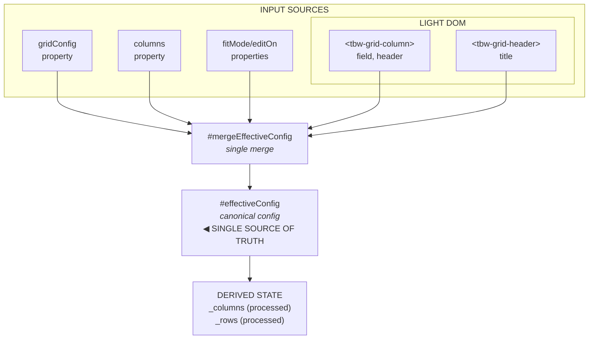
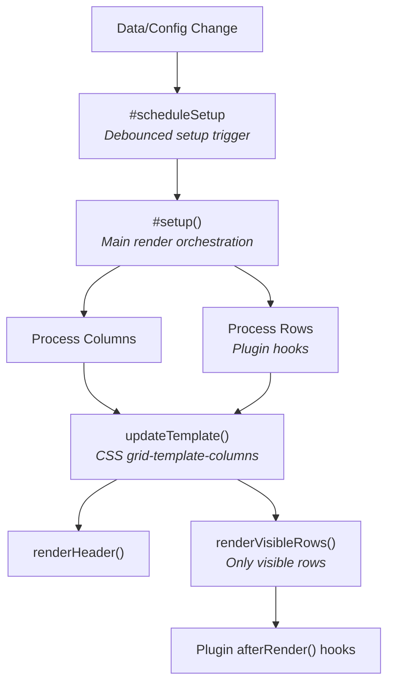
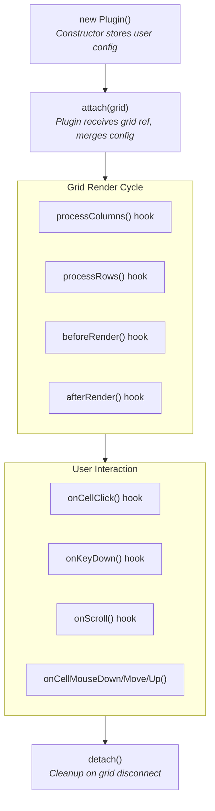

# @toolbox-web/grid Architecture

This document explains the internal architecture of the grid component for contributors and plugin developers.

## Table of Contents

- [Overview](#overview)
- [Configuration Architecture](#configuration-architecture)
- [Directory Structure](#directory-structure)
- [Core Components](#core-components)
- [Rendering Pipeline](#rendering-pipeline)
- [Virtualization](#virtualization)
- [Column Configuration Precedence](#column-configuration-precedence)
- [Plugin System](#plugin-system)
- [Event Flow](#event-flow)
- [Styling Architecture](#styling-architecture)

---

## Overview

`<tbw-grid>` is a high-performance data grid implemented as a native Web Component using Shadow DOM. Key design principles:

1. **Framework-Agnostic**: Pure TypeScript/HTML, no runtime framework dependencies
2. **Virtualized**: Only visible rows are rendered; supports 100k+ rows
3. **Extensible**: Plugin architecture for optional features
4. **Type-Safe**: Strongly typed with TypeScript generics
5. **Single Source of Truth**: All configuration converges into one effective config

```
┌───────────────────────────────────────────────────────┐
│                        <tbw-grid>                     │
│  ┌─────────────────────────────────────────────────┐  │
│  │                    Shadow DOM                   │  │
│  │  ┌───────────────────────────────────────────┐  │  │
│  │  │              Header Row                   │  │  │
│  │  └───────────────────────────────────────────┘  │  │
│  │  ┌───────────────────────────────────────────┐  │  │
│  │  │           Rows Viewport (scrollable)      │  │  │
│  │  │  ┌─────────────────────────────────────┐  │  │  │
│  │  │  │  Spacer (virtual scroll height)     │  │  │  │
│  │  │  ├─────────────────────────────────────┤  │  │  │
│  │  │  │  Visible Rows (row pool)            │  │  │  │
│  │  │  └─────────────────────────────────────┘  │  │  │
│  │  └───────────────────────────────────────────┘  │  │
│  └─────────────────────────────────────────────────┘  │
└───────────────────────────────────────────────────────┘
```

---

## Configuration Architecture

The grid follows a **single source of truth** pattern. All configuration inputs converge into one `effectiveConfig` object, which is then used for all rendering and behavior.

### Why Single Source of Truth?

- **Predictable behavior**: One canonical config means no ambiguity about which setting applies
- **Easy debugging**: Inspect `effectiveConfig` to see exactly what the grid is using
- **Flexible input**: Users can configure via the method most convenient for their use case
- **Plugin-friendly**: Plugins can read/modify config through one consistent interface

### Input Sources

Users can configure the grid through multiple input methods:



### Precedence Rules

When the same property is set via multiple sources, higher precedence wins:

| Priority    | Source                | Example                                      |
| ----------- | --------------------- | -------------------------------------------- |
| 1 (lowest)  | HTML attributes       | `<tbw-grid rows='[...]' fit-mode="stretch">` |
| 2           | `gridConfig` property | `grid.gridConfig = { fitMode: 'stretch' }`   |
| 3           | Light DOM elements    | `<tbw-grid-column field="name">`             |
| 4           | `columns` property    | `grid.columns = [{ field: 'name' }]`         |
| 5           | Inferred columns      | (auto-detected from first row)               |
| 6 (highest) | Individual props      | `grid.fitMode = 'fixed'`                     |

### HTML Attribute Configuration

The grid supports JSON-serialized configuration via HTML attributes:

```html
<tbw-grid
  rows='[{"id":1,"name":"Alice"},{"id":2,"name":"Bob"}]'
  columns='[{"field":"id","header":"ID"},{"field":"name","header":"Name"}]'
  fit-mode="stretch"
  edit-on="dblClick"
>
</tbw-grid>
```

Supported attributes:

- `rows` - JSON array of row data
- `columns` - JSON array of column configurations
- `grid-config` - JSON object with full GridConfig
- `fit-mode` - String: `'stretch'` or `'fixed'`
- `edit-on` - String: `'click'` or `'dblClick'`

### Light DOM Configuration

The grid parses these light DOM elements on connection:

```html
<tbw-grid>
  <!-- Column definitions (→ effectiveConfig.columns) -->
  <tbw-grid-column field="name" header="Name" sortable></tbw-grid-column>
  <tbw-grid-column field="age" header="Age" type="number"></tbw-grid-column>

  <!-- Shell header (→ effectiveConfig.shell.header) -->
  <tbw-grid-header title="My Data Grid">
    <!-- Custom header content (→ effectiveConfig.shell.header.content) -->
    <tbw-grid-header-content>
      <span>Custom content here</span>
    </tbw-grid-header-content>

    <!-- Custom toolbar buttons -->
    <tbw-grid-tool-button label="Refresh" icon="🔄"></tbw-grid-tool-button>
  </tbw-grid-header>
</tbw-grid>
```

### Internal State Categories

The grid maintains three categories of state:

1. **Input Properties** (`#rows`, `#columns`, `#gridConfig`, `#fitMode`, `#editOn`)
   - Raw user input, never read directly for rendering
   - Merged into `#effectiveConfig` by `#mergeEffectiveConfig()`

2. **Effective Config** (`#effectiveConfig`)
   - The **single source of truth** after merging all inputs
   - All rendering and logic reads from here
   - Immutable during a render cycle

3. **Derived State** (`_columns`, `_rows`)
   - Result of processing `effectiveConfig` through plugin hooks
   - `_columns` = `effectiveConfig.columns` after `processColumns()` hooks
   - `_rows` = input rows after `processRows()` hooks (grouping, filtering, etc.)

4. **Runtime State** (`#hiddenColumns`, `sortState`, etc.)
   - User-driven changes at runtime (visibility, sorting)
   - Managed separately for save/restore functionality

---

## Directory Structure

```
libs/grid/src/
├─ index.ts                # Main entry (auto-registers element)
├─ public.ts               # Public API surface (types, constants)
├─ all.ts                  # All-in-one bundle with all plugins
└─ lib/
   ├─ core/
   │  ├─ grid.ts             # Main component class
   │  ├─ grid.css            # Core styles
   │  ├─ types.ts            # Public type definitions
   │  ├─ constants.ts        # DOM class/attribute constants
   │  ├─ internal/           # Pure helper functions
   │  │  ├─ aggregators.ts    # Footer aggregation functions
   │  │  ├─ column-state.ts   # Column state management
   │  │  ├─ columns.ts        # Column resolution, sizing
   │  │  ├─ dom-builder.ts    # Direct DOM construction utilities
   │  │  ├─ editing.ts        # Cell/row edit logic
   │  │  ├─ editors.ts        # Built-in cell editors
   │  │  ├─ event-delegation.ts # Delegated event handlers
   │  │  ├─ header.ts         # Header rendering
   │  │  ├─ idle-scheduler.ts # requestIdleCallback wrapper
   │  │  ├─ inference.ts      # Column type inference
   │  │  ├─ keyboard.ts       # Keyboard navigation
   │  │  ├─ resize.ts         # Column resizing
   │  │  ├─ rows.ts           # Row rendering
   │  │  ├─ sanitize.ts       # Template security
   │  │  ├─ shell.ts          # Shell/toolbar rendering
   │  │  ├─ sorting.ts        # Sort comparators
   │  │  ├─ touch-scroll.ts   # Touch/momentum scrolling
   │  │  ├─ utils.ts          # Shared utilities
   │  │  └─ virtualization.ts # Virtual scroll math
   │  └─ plugin/             # Plugin infrastructure
   │     ├─ base-plugin.ts    # Abstract base class
   │     ├─ plugin-manager.ts # Plugin lifecycle
   │     └─ index.ts          # Plugin system exports
   └─ plugins/                # Built-in plugins
      ├─ clipboard/            # Copy/paste support
      ├─ column-virtualization/ # Horizontal virtualization
      ├─ context-menu/         # Right-click menus
      ├─ export/               # CSV/Excel export
      ├─ filtering/            # Column filters
      ├─ grouping-columns/     # Column header grouping
      ├─ grouping-rows/        # Row grouping with aggregates
      ├─ master-detail/        # Expandable row details
      ├─ multi-sort/           # Multi-column sorting
      ├─ pinned-columns/       # Frozen columns
      ├─ pinned-rows/          # Frozen rows (top/bottom)
      ├─ pivot/                # Pivot table transformation
      ├─ reorder/              # Drag column reordering
      ├─ selection/            # Row/cell/range selection
      ├─ server-side/          # Server-side data loading
      ├─ tree/                 # Hierarchical tree data
      ├─ undo-redo/            # Edit history
      └─ visibility/           # Column show/hide
```

### Key Conventions

- **Internal modules** (`internal/*.ts`): Pure functions, no side effects, fully unit-tested
- **Plugin modules** (`plugins/*/`): Each plugin is self-contained with its own types, logic, and tests
- **Co-located tests**: `foo.ts` has `foo.spec.ts` in the same directory

---

## Core Components

### DataGridElement (`grid.ts`)

The main custom element class (~1100 lines). Responsibilities:

1. **Property Management**: `rows`, `columns`, `gridConfig` with reactive setters
2. **Shadow DOM Setup**: Creates internal structure, injects styles
3. **Render Orchestration**: Triggers re-renders on data/config changes
4. **Event Dispatch**: Publishes events like `cell-commit`, `sort-change`
5. **Plugin Coordination**: Manages plugin lifecycle via PluginManager

```typescript
class DataGridElement<T> extends HTMLElement {
  // Public properties
  rows: T[];
  columns: ColumnConfig<T>[];
  gridConfig: GridConfig<T>;

  // Internal state
  #pluginManager: PluginManager;
  #effectiveConfig: GridConfig<T>;
  _columns: ColumnInternal<T>[]; // Resolved columns
  _rows: T[]; // Processed rows
}
```

### PluginManager (`plugin-manager.ts`)

Manages the plugin lifecycle:

```typescript
class PluginManager {
  attach(plugin: BaseGridPlugin): void; // Register plugin
  detach(plugin: BaseGridPlugin): void; // Unregister plugin
  getPlugin<T>(PluginClass): T | undefined; // Get instance by class

  // Hook dispatchers
  processRows(rows: T[]): T[];
  processColumns(columns: ColumnConfig[]): ColumnConfig[];
  afterRender(): void;
  onCellClick(event: CellClickEvent): boolean;
  // ... more hooks
}
```

---

## Rendering Pipeline

The grid follows a predictable render flow:



### Key Functions

| Function                   | File                | Purpose                          |
| -------------------------- | ------------------- | -------------------------------- |
| `getColumnConfiguration()` | `columns.ts`        | Resolves effective column config |
| `updateTemplate()`         | `columns.ts`        | Generates CSS grid template      |
| `renderHeader()`           | `header.ts`         | Renders header row               |
| `renderVisibleRows()`      | `rows.ts`           | Renders virtualized body rows    |
| `computeVirtualWindow()`   | `virtualization.ts` | Calculates visible row range     |

---

## Virtualization

The grid uses **row virtualization** to handle large datasets efficiently.

### How It Works

1. **Spacer Element**: A `div` with height = `totalRows × rowHeight` creates the scroll area
2. **Row Pool**: Only ~20-50 row elements exist in DOM at any time
3. **Window Calculation**: On scroll, compute which rows are visible
4. **Row Recycling**: Reuse existing row elements, just update content

```typescript
interface VirtualState {
  rowHeight: number; // Default: 28px
  headerHeight: number; // Default: 32px
  overscan: number; // Extra rows above/below viewport (default: 8)
  startIndex: number; // First visible row index
  endIndex: number; // Last visible row index
  offsetY: number; // CSS transform offset
}
```

### Bypass for Small Datasets

For very small datasets (≤8 rows by default), virtualization overhead isn't worth it:

```typescript
function shouldBypassVirtualization(rowCount: number, threshold = 8): boolean {
  return rowCount <= threshold;
}
```

### Scroll Handler

```typescript
// Simplified scroll handling
onScroll(event: Event) {
  const { scrollTop } = event.target;
  const { startIndex, endIndex, offsetY } = computeVirtualWindow(
    scrollTop,
    viewportHeight,
    rowHeight,
    totalRows,
    overscan
  );

  // Only re-render if visible window changed
  if (startIndex !== prevStart || endIndex !== prevEnd) {
    renderVisibleRows(rows.slice(startIndex, endIndex));
    rowsContainer.style.transform = `translateY(${offsetY}px)`;
  }
}
```

---

## Column Configuration Precedence

Columns can be configured from multiple sources. They're merged with this precedence (lowest to highest):

```
1. gridConfig.columns          (base config)
2. Light DOM <tbw-grid-column> (declarative)
3. columns prop                (direct assignment)
4. Inferred columns            (from first row)
5. Individual props            (fitMode, editOn, etc.)
```

### Resolution Flow

```typescript
function getColumnConfiguration(grid: InternalGrid): ColumnInternal[] {
  // 1. Start with gridConfig columns
  let cols = grid.gridConfig?.columns ?? [];

  // 2. Merge light DOM columns (parsed once on connect)
  if (grid.__lightDomColumnsCache) {
    cols = mergeLightDomColumns(cols, grid.__lightDomColumnsCache);
  }

  // 3. Override with columns prop if set
  if (grid.columns) {
    cols = grid.columns;
  }

  // 4. Infer missing columns from data
  if (cols.length === 0 && grid._rows.length > 0) {
    cols = inferColumns(grid._rows[0]);
  }

  // 5. Apply column-level defaults and process
  return cols.map(processColumn);
}
```

---

## Plugin System

### Plugin Lifecycle



### Creating a Plugin

```typescript
import { BaseGridPlugin, CellClickEvent } from '@toolbox-web/grid';

interface MyPluginConfig {
  enabled?: boolean;
  myOption?: string;
}

export class MyPlugin extends BaseGridPlugin<MyPluginConfig> {
  readonly name = 'myPlugin';
  readonly version = '1.0.0';

  // CSS injected into shadow DOM
  readonly styles = `
    .my-highlight { background: yellow; }
  `;

  protected get defaultConfig(): Partial<MyPluginConfig> {
    return { enabled: true, myOption: 'default' };
  }

  // Lifecycle
  attach(grid: GridElement): void {
    super.attach(grid); // MUST call super
    // Setup listeners, state, etc.
  }

  detach(): void {
    // Cleanup
  }

  // Hooks
  afterRender(): void {
    if (!this.config.enabled) return;
    // Manipulate rendered DOM
  }

  onCellClick(event: CellClickEvent): boolean | void {
    // Return true to prevent default behavior
  }
}
```

### Plugin Communication

Plugins can access other plugins:

```typescript
// In a plugin method
const selection = this.getPlugin(SelectionPlugin);
if (selection) {
  const selectedRows = selection.getSelectedRows();
}
```

---

## Event Flow

### Grid Events

Core events emitted by the grid itself:

| Event                   | Detail Type                 | When                          |
| ----------------------- | --------------------------- | ----------------------------- |
| `cell-commit`           | `CellCommitDetail`          | Cell value committed          |
| `row-commit`            | `RowCommitDetail`           | Row edit committed            |
| `changed-rows-reset`    | `void`                      | Changed rows cleared          |
| `sort-change`           | `SortChangeDetail`          | Sort state changed            |
| `column-resize`         | `ColumnResizeDetail`        | Column resized                |
| `activate-cell`         | `ActivateCellDetail`        | Cell focus changed            |
| `group-toggle`          | `GroupToggleDetail`         | Group row expanded/collapsed  |
| `column-state-change`   | `ColumnStateChangeDetail`   | Column config changed         |
| `mount-external-view`   | `MountExternalViewDetail`   | External view renderer needed |
| `mount-external-editor` | `MountExternalEditorDetail` | External editor needed        |

### Plugin Events

Plugins emit their own events via `this.emit()`:

| Event                      | Plugin       | Detail                   |
| -------------------------- | ------------ | ------------------------ |
| `selection-change`         | Selection    | `SelectionChangeDetail`  |
| `tree-expand`              | Tree         | `TreeExpandDetail`       |
| `filter-change`            | Filtering    | `FilterModel`            |
| `sort-model-change`        | MultiSort    | `SortModel[]`            |
| `export-start`             | Export       | `ExportStartDetail`      |
| `export-complete`          | Export       | `ExportCompleteDetail`   |
| `clipboard-copy`           | Clipboard    | `ClipboardCopyDetail`    |
| `clipboard-paste`          | Clipboard    | `ClipboardPasteDetail`   |
| `context-menu-open`        | ContextMenu  | `ContextMenuOpenDetail`  |
| `context-menu-close`       | ContextMenu  | `void`                   |
| `history-change`           | UndoRedo     | `HistoryChangeDetail`    |
| `server-loading`           | ServerSide   | `boolean`                |
| `server-error`             | ServerSide   | `Error`                  |
| `column-visibility-change` | Visibility   | `VisibilityChangeDetail` |
| `column-reorder`           | Reorder      | `ReorderDetail`          |
| `detail-expand`            | MasterDetail | `DetailExpandDetail`     |
| `group-expand`             | GroupingRows | `GroupExpandDetail`      |

### Event Constants

```typescript
import { DGEvents, PluginEvents } from '@toolbox-web/grid';

grid.addEventListener(DGEvents.CELL_COMMIT, (e) => { ... });
grid.addEventListener(PluginEvents.SELECTION_CHANGE, (e) => { ... });
```

---

## Styling Architecture

### CSS Custom Properties

All styling uses CSS custom properties for theming:

```css
tbw-grid {
  /* Colors */
  --tbw-color-bg: #ffffff;
  --tbw-color-fg: #1a1a1a;
  --tbw-color-border: #e5e5e5;
  --tbw-color-header-bg: #f5f5f5;

  /* Sizing */
  --tbw-row-height: 28px;
  --tbw-header-height: 32px;

  /* Typography */
  --tbw-font-family: system-ui, sans-serif;
  --tbw-font-size: 13px;
}
```

### Plugin Styles

Plugins inject CSS via their `styles` property:

```typescript
class SelectionPlugin extends BaseGridPlugin {
  readonly styles = `
    .data-row.selected {
      background: var(--tbw-selection-bg, var(--tbw-color-selection));
    }
  `;
}
```

Styles are injected once per plugin into the grid's shadow DOM.

### Layered Fallback Pattern

Plugins use fallback chains for maximum flexibility:

```css
/* Plugin-specific → Global fallback */
background: var(--tbw-selection-bg, var(--tbw-color-selection));
```

This allows:

1. Override just one plugin: `--tbw-selection-bg: blue;`
2. Or change all selections: `--tbw-color-selection: blue;`

---

## DOM Structure

### CSS Classes

All class names are defined in `constants.ts` (`GridClasses`):

| Class            | Element   | Purpose                       |
| ---------------- | --------- | ----------------------------- |
| `.tbw-grid-root` | Container | Root wrapper                  |
| `.header`        | Container | Header section                |
| `.header-row`    | Row       | Header cells container        |
| `.cell`          | Cell      | Header or data cell           |
| `.rows-viewport` | Container | Scrollable body area          |
| `.rows-spacer`   | Div       | Creates virtual scroll height |
| `.rows`          | Container | Visible rows container        |
| `.data-row`      | Row       | Individual data row           |
| `.group-row`     | Row       | Grouped row header            |

### Data Attributes

All attribute names are defined in `constants.ts` (`GridDataAttrs`):

| Attribute        | Element     | Value                   |
| ---------------- | ----------- | ----------------------- |
| `data-row-index` | `.data-row` | Row index in data array |
| `data-col-index` | `.cell`     | Column index            |
| `data-field`     | `.cell`     | Column field name       |

---

## Performance Considerations

The grid employs multiple optimization strategies to achieve high performance with large datasets.

### DOM Optimization

| Technique                   | Implementation                                      | Benefit                           |
| --------------------------- | --------------------------------------------------- | --------------------------------- |
| **Template Cloning**        | `rows.ts` uses `<template>` elements for rows/cells | 3-4x faster than `createElement`  |
| **Direct DOM Construction** | `dom-builder.ts` builds DOM programmatically        | Avoids innerHTML parsing overhead |
| **DocumentFragment**        | Batch cell insertion into fragment before appending | Single reflow per row             |
| **Row Pooling**             | Reuse row elements during scroll                    | Zero allocation during scroll     |
| **Cached DOM Refs**         | `__rowsBodyEl`, `__scrollAreaEl` cached on grid     | Avoid querySelector per scroll    |

### Rendering Pipeline

| Technique              | Implementation                                    | Benefit                         |
| ---------------------- | ------------------------------------------------- | ------------------------------- |
| **Batched Updates**    | `#queueUpdate()` coalesces property changes       | Single render for rapid changes |
| **RAF Scheduling**     | Scroll handlers use `requestAnimationFrame`       | Smooth 60fps scrolling          |
| **Idle Scheduling**    | `idle-scheduler.ts` defers non-critical work      | Faster time-to-interactive      |
| **Fast-Path Patching** | `fastPatchRow()` for plain text grids             | Skip expensive template logic   |
| **Cell Display Cache** | `getCellDisplayValue()` memoizes formatted values | Avoid recomputing during scroll |

### Event Handling

| Technique                   | Implementation                                        | Benefit                            |
| --------------------------- | ----------------------------------------------------- | ---------------------------------- |
| **Event Delegation**        | Single listener at body level (`event-delegation.ts`) | Constant memory regardless of rows |
| **Pooled Scroll Events**    | `#pooledScrollEvent` reused object                    | Zero GC pressure during scroll     |
| **AbortController Cleanup** | `disconnectSignal` for automatic listener removal     | No memory leaks on disconnect      |

### State Management

| Technique                    | Implementation                           | Benefit                            |
| ---------------------------- | ---------------------------------------- | ---------------------------------- |
| **O(1) Editing Checks**      | `hasEditingCells()` counter-based        | Avoid querySelector in hot path    |
| **Epoch-Based Invalidation** | `__rowRenderEpoch` triggers full rebuild | Minimal DOM updates on data change |
| **Column Visibility Flags**  | `_visibleColumns` getter filters hidden  | Avoid iteration during render      |

### Memory Efficiency

- **Row Pool Size**: Pool grows to viewport + overscan, never shrinks during scroll
- **Cache Invalidation**: Cell cache cleared on epoch change, not per-cell
- **Lazy Plugin Styles**: Styles injected once after initial render

### What to Avoid

- ❌ `querySelector` in scroll/render paths (use cached refs)
- ❌ Creating objects in hot loops (reuse pooled objects)
- ❌ `innerHTML` for data content (use `textContent` or DOM APIs)
- ❌ Synchronous layout reads after writes (batch reads before writes)

---

## Testing Strategy

| Test Type   | Location                 | What to Test                |
| ----------- | ------------------------ | --------------------------- |
| Unit        | `internal/*.spec.ts`     | Pure functions in isolation |
| Plugin Unit | `plugins/*/*.spec.ts`    | Plugin logic without DOM    |
| Integration | `__tests__/integration/` | Full component behavior     |

### Key Test Helpers

```typescript
import { waitUpgrade, nextFrame } from './test/helpers';

// Wait for element upgrade and ready()
const grid = document.createElement('tbw-grid');
document.body.appendChild(grid);
await waitUpgrade(grid);

// Wait for render to complete
await nextFrame();
```

---

## Contributing

1. **Internal logic** goes in `core/internal/` as pure functions
2. **New features** should be plugins when possible
3. **Tests first**: Add/update tests before implementation
4. **No magic strings**: Use constants for DOM classes and event names
5. **Document hooks**: Add JSDoc with examples to new plugin hooks
